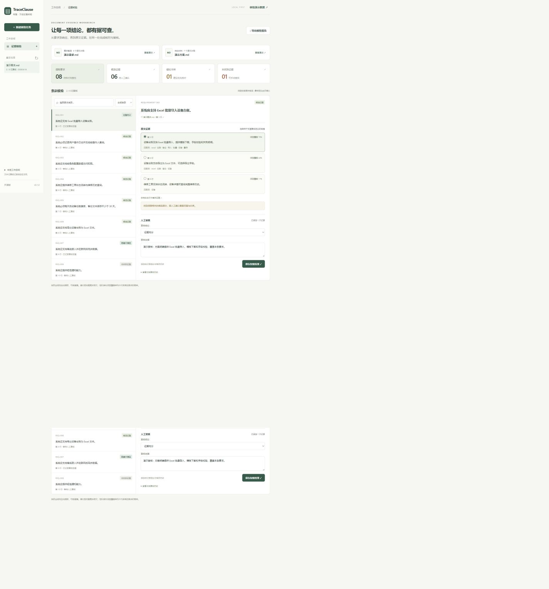

# TraceClause · 有据

**让每一项结论，都有据可查。**

A local-first document requirements and evidence review workbench. Import requirements and a response, retrieve source quotations, record human decisions, and export a traceable review report.

TraceClause 把「要求 → 候选原文 → 人工结论 → 复核依据」串成可追溯的核验记录，适合技术方案响应检查、需求覆盖检查和验收材料核对。第一版无需模型密钥，文档内容不会发送到外部 AI 服务。

> 当前是单人本地使用的 v0.1.0 基线版本。自动结果是候选检索提示，不是合规结论；同义改写、复杂表格与隐含约束仍需要人工核对。



## 已实现

- 导入文字型 PDF、DOCX、UTF-8 TXT / Markdown，单文件最多 10 MB。
- PDF 页码、DOCX 段落/表格行、文本行号定位；保留原始文件和 SHA-256 指纹。
- 通过要求词提取条款，保留精确引文与字符偏移。
- 中文双字词与英文词 BM25 检索，展示前三个候选、匹配词及词面覆盖率。
- 区分候选证据、疑似冲突、未找到证据；提示部分数值差异。
- 全文查看与手动选择证据，支持证据充分、部分覆盖、明确不满足、未找到证据和非要求条款等人工结论。
- SQLite 持久化、复核变更记录及乐观并发检查，防止旧页面覆盖新结论。
- Markdown 报告、CSV 清单、JSON 完整记录导出；CSV 对公式前缀进行转义。
- 内置演示文档、自动化测试、透明的小型评测集和 GitHub Actions。

## 快速启动

要求 Python 3.11 或更高版本。Windows PowerShell：

```powershell
git clone https://github.com/LingxiangXu/traceclause.git
cd traceclause
python -m venv .venv
.\.venv\Scripts\python.exe -m pip install -e .
.\.venv\Scripts\python.exe -m uvicorn traceclause.app:app --host 127.0.0.1 --port 8765
```

打开 <http://127.0.0.1:8765>，点击「先看看演示」。后续也可运行 `./start.ps1`。

macOS / Linux：

```bash
python3 -m venv .venv
.venv/bin/python -m pip install -e .
.venv/bin/python -m uvicorn traceclause.app:app --host 127.0.0.1 --port 8765
```

Docker（提供配置，首次交付尚未实测容器构建）：

```bash
docker compose up --build
```

应用数据默认位于工作目录 `data/traceclause.sqlite3`，可用环境变量 `TRACECLAUSE_DB` 指定其他路径。数据与上传原文均被 Git 忽略。备份数据库前请停止服务。服务默认仅绑定本机；当前没有用户认证与租户隔离，请勿直接暴露到公网。

## 一次完整核验

1. 新建任务，上传需求文件与对应的响应材料。
2. 查看提取条款，并对照完整需求原文检查遗漏。当前版本不能在界面手工补录条款；遗漏时请整理成包含明确要求表述的文本后新建任务。
3. 点击条款，对照候选证据与原文位置。候选不合适时可在响应全文中手动选择一段证据。
4. 选择人工结论、填写依据并保存。证据充分、部分覆盖、明确不满足均必须绑定原文证据。
5. 导出核验报告；未复核项始终保留待复核标识。

每次任务固定一对原始文档。文件变更时请创建新任务；跨版本影响分析尚未实现。

## 技术架构与边界

```text
Browser UI (HTML / CSS / JavaScript)
           │ FastAPI API
           ├── parsing.py  → source blocks + exact offsets
           ├── matching.py → BM25 candidates + conservative hints
           └── SQLite     → original files + review snapshot + audit events
```

选择轻量本地架构，是为了先建立可验证、无需密钥的检索基线。没有引入向量数据库、远程模型或任务集群。

- PDF 使用 [pypdf](https://pypdf.readthedocs.io/en/stable/user/extract-text.html) 提取文字，不提供 OCR；部分空白页会提示。
- DOCX 使用 [python-docx](https://python-docx.readthedocs.io/en/latest/api/document.html) 按正文段落与表格顺序解析；不推测页码。不覆盖文本框、页眉页脚和嵌套表格中的全部内容。
- 文件上传接口基于 [FastAPI](https://fastapi.tiangolo.com/tutorial/request-files/)。
- 数值提示只检查数字是否出现，不理解单位换算和大小关系；否定词提示不构成逻辑蕴含判断。
- PDF 页面里的阅读顺序、分栏和表格结构可能失真，证据通常为页级片段。
- 当前一次最多 500 条要求，文档最多 5000 片段 / 50 万字符 / 200 页 PDF。解析器不是不可信文件沙箱；这是小规模本地工具。
- 当前一条要求仅绑定一个人工选定证据段；复核记录没有身份签名或防篡改能力。

## 验证与评测

```bash
python -m pip install -e ".[dev]"
python -m pytest -q
python benchmarks/evaluate.py
```

首次本地验证：Windows、Python 3.13，25 项测试通过。测试覆盖解析、原文定位、拒绝无文字 PDF、复核持久化、过期版本拒绝、证据校验、导出与 CSV 公式转义。

内置 **10 条人工编写样例**，9 条存在相关证据：首位相关证据命中 7/9（77.8%），提示类别匹配 8/10（80%）。其中两个同义改写失败案例刻意保留。此样例集规模很小，与开发样例有重合，只用于解释行为和发现回归，**不代表真实文档准确率，也不是独立测试集**。

## 后续深度路线

| 阶段 | 核心问题 | 可验证的交付标准 |
| --- | --- | --- |
| v0.2 | 提取与检索质量 | 人工补录/拆分条款，建立独立标注集；比较 BM25、向量及混合检索的 Recall@k |
| v0.3 | 约束核对 | 数字、单位、时间范围与否定作用域抽取；单独报告各类错误与拒答情况 |
| v0.4 | 文档版本影响 | 条款增删改对齐、证据变化追踪、受影响人工结论自动转为待重审 |
| v0.5 | 文档结构 | 接入 Docling/OCR、跨页表格、证据框定位；评测页码与区域引用准确率 |

这些是路线规划，不是当前已完成的能力。优先贡献可复现的失败样例、引用定位问题和独立标注数据。

## 贡献与许可

见 [CONTRIBUTING.md](CONTRIBUTING.md)、[架构说明](docs/architecture.md) 和 [安全边界](SECURITY.md)。代码采用 [MIT License](LICENSE)。示例文档为项目演示编写，不包含客户材料。
