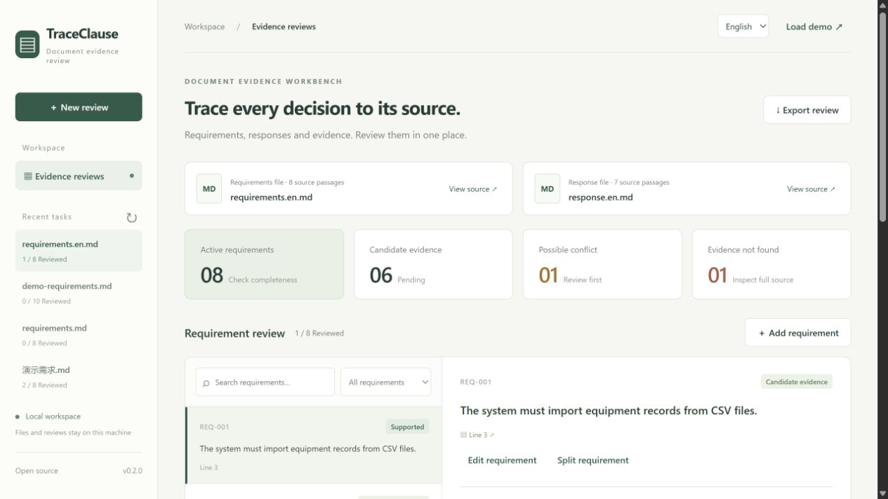

# TraceClause

[](https://github.com/LingxiangXu/traceclause/actions/workflows/ci.yml)
[](LICENSE)

[](pyproject.toml)

**Trace every review decision to its source.**

TraceClause is a local document requirements and evidence review workbench. Compare a requirements document with a proposal or response, inspect retrieved quotations, record human decisions, and export a traceable report.

Version 0.2.0 is a local, single-user preview with English and Chinese interfaces and report labels. It requires no model API key and makes no external AI calls with document content. Automatic hints identify material to inspect; they do not establish compliance or verify that a described feature actually works.



## Features

- Text-based PDF, DOCX, UTF-8 TXT and Markdown import.
- PDF page references, DOCX paragraph/table-row references and text line references.
- Original file bytes, SHA-256 fingerprints and exact requirement quotation offsets.
- Chinese character-bigram and English word BM25 retrieval with up to three candidates, shared terms and lexical coverage.
- Separate candidate, possible-conflict and missing-evidence hints. Numerical discrepancies may trigger a review reminder.
- Manually add, edit and split requirements while retaining original quotations and earlier decisions.
- Human review with multiple selected source passages, written rationale and change history.
- Browser-local drafts that survive refresh and task switches, with explicit stale-draft comparison.
- English/Chinese UI and Markdown/CSV report labels; original quotations and rationales remain unchanged.
- SQLite persistence and revision checks that reject stale updates.
- Markdown, CSV and JSON exports, plus sample documents and a small transparent benchmark.

## Quick start

Use Python 3.11 or newer. Windows PowerShell:

```powershell
git clone https://github.com/LingxiangXu/traceclause.git
cd traceclause
python -m venv .venv
.\.venv\Scripts\python.exe -m pip install -e .
.\.venv\Scripts\python.exe -m uvicorn traceclause.app:app --host 127.0.0.1 --port 8765
```

macOS / Linux:

```bash
git clone https://github.com/LingxiangXu/traceclause.git
cd traceclause
python3 -m venv .venv
.venv/bin/python -m pip install -e .
.venv/bin/python -m uvicorn traceclause.app:app --host 127.0.0.1 --port 8765
```

Open <http://127.0.0.1:8765>, choose **English** in the language selector, and click **Try the demo** or **Load demo** to create a demo review. **New review** imports your own pair of documents. Select a requirement, inspect evidence, write a rationale, and save a review. Use **Add requirement**, **Edit requirement** or **Split requirement** to correct extraction. **Export review** downloads the saved results.

The one-click demo uses Chinese source documents. For an English walkthrough, import [requirements.en.md](traceclause/samples/requirements.en.md) and [response.en.md](traceclause/samples/response.en.md). These synthetic examples are demonstration material, separate from the v0.2 evaluation set.

A Docker Compose configuration is included (`docker compose up --build`), but container build/runtime validation has not yet been performed for this release. The published CI covers Python tests on Windows and Linux, not Docker or macOS.

## Limits and data handling

Files and saved reviews remain in `data/traceclause.sqlite3`, relative to the working directory. `TRACECLAUSE_DB` overrides that path. Stop the service before copying the database for backup. Drafts are stored separately in this browser's local storage, scoped to the site address, task, item and window. They are not included in database backups or reports. The data directory is excluded from Git; exported reports may still contain your source text.

Before upgrading from v0.1, back up the database. Existing snapshots are read with additive defaults; the next successful edit persists the v0.2 schema. Original file bytes and earlier review events are retained. Keep the backup if you need to return to v0.1; old clients cannot represent multiple evidence selections or split parents correctly.

This release has no authentication, tenant isolation or parser sandbox. Keep it on a trusted local machine, bound to `127.0.0.1`. Audit history is not signed or tamper-evident.

- Up to 10 MB per file, 200 PDF pages, 5,000 extracted blocks, 500,000 extracted characters and 500 extracted requirements per task.
- No OCR for scanned PDFs. Complex PDF reading order and tables may be inaccurate.
- DOCX page numbers are not inferred; headers, footers, text boxes and nested tables are not fully covered.
- Requirement extraction is heuristic and may miss clauses. Manually recover omissions from parsed source blocks; text omitted by the parser must be prepared and imported in a new task.
- Matching is lexical, not semantic entailment. Paraphrases may be missed. Numeric checks do not compare units or inequalities.
- Up to 100 selected evidence passages per review; 2–20 child requirements per split, within the 500 active requirement limit. Document replacement and cross-version impact analysis are planned, not implemented.

## Tests and evaluation

```bash
python -m pip install -e ".[dev]"
python -m pytest -q
python benchmarks/evaluate.py
python benchmarks/evaluate_holdout.py
node --test tests/test_drafts.cjs
```

The Python suite covers compatibility, source spans, multiple evidence, transactional edits/splits and exports. Five dependency-free Node tests cover draft persistence, window isolation, recovery and storage failures. CI runs on Windows/Linux with Python 3.11/3.13 and Node 24; the application itself does not require Node.

The unchanged retrieval engine retains the original 10-case development benchmark (first evidence hit: 7/9). A separate v0.2 set contains 14 synthetic documents and 15 annotated requirements: exact extraction precision 12/13 (92.3%), recall 12/15 (80.0%), retrieval Hit@1 and macro Recall@3 both 84.6%. The set does not reuse demo documents, but has no independent expert annotation or real-world validation. See [evaluation definitions and retained failures](docs/evaluation.md).

## Documentation and contribution

| Resource | What it covers |
| --- | --- |
| [User guide](docs/user-guide.md) | Import, review, export, storage and troubleshooting |
| [API examples](docs/api.md) | Requests, validation and errors |
| [Architecture](docs/architecture.md) | Retrieval, references and consistency |
| [Evaluation](docs/evaluation.md) | Metrics, failures and limitations |
| [Roadmap](ROADMAP.md) | Planned work and acceptance criteria |
| [Changelog](CHANGELOG.md) | Version history |
| [v0.2 example report](docs/examples/v02-review-report.md) | An exported English report with multiple evidence passages |
| [v0.1 walkthrough](docs/examples/review-report.md) | The original synthetic review example |

To contribute, reproduce an issue with synthetic or authorized public documents, add meaningful regression coverage for behavior changes, and run the tests. Retrieval changes should report both improvements and regressions on the benchmark. Do not publish private customer documents, personal data or credentials in issues. See [CONTRIBUTING.md](CONTRIBUTING.md) and [SECURITY.md](SECURITY.md).

Code is licensed under the [MIT License](LICENSE). Demo documents were written for this project.
